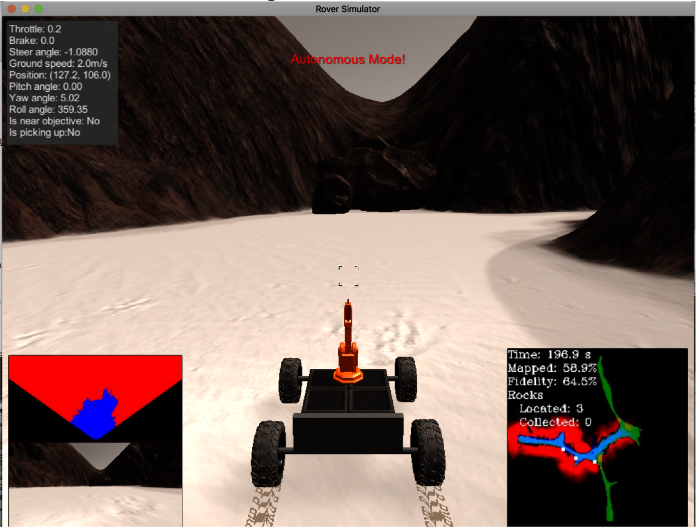

# RoboND
A few robotic projects I worked back in 2017 with Udacity. Some codes and writings were lost. 
First project was about how to make a simple algorithmn that would help the rover avoid obstacles and find rocks on the way.

Second project was about calculating forward kinematics and backward kinematics of given kuka robot and implement them using Python and ROS

Third project was about using point cloud and ML to detect, identify, and pick and place the objects 

